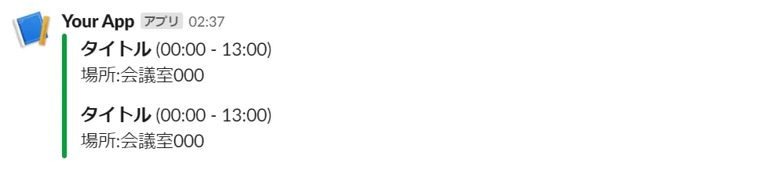
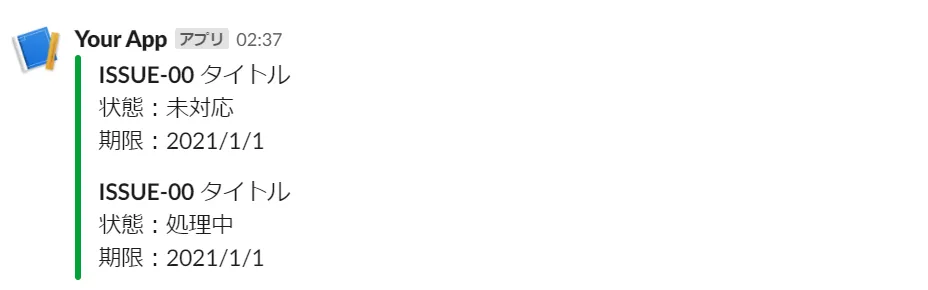

## make-dashboard
SlackBotを使用し、Googleカレンダーのイベント情報とBacklog課題一覧をSlackに表示します。  

Slack イメージ

## 利用方法
AWS Lambdaを使用して定時実行することを想定しているため、AWS Lambdaに`make-dashboard`ディレクトリ内のコードをアップロードしてください。  
SlackからBacklog課題一覧を更新する機能を使用する場合は、API Gatewayの構築が必要です。
### make-dashboard
カレンダーの情報は、サービスアカウント使用して取得します。    
GoogleAPIからサービスアカウントの払い出しと、カレンダーの共有設定が必要です。  

環境変数の設定が必要です。下記環境変数を設定してください。
|変数|値|備考|
|--|--|--|
|APIKEY|BacklogのAPIキー||
|CHANNEL|通知先Slackチャンネル名||
|EMAIL|参照するGoogleカレンダーを所有するメールアドレス|カレンダーID|
|JSONPATH|サービスアカウントのjsonファイルのパス||
|TOKEN|SlackBotのAPIキー||
|USERID|BacklogのユーザーID|このユーザの課題一覧を表示|
### SlackBot
Slackへの通知のためにSlackBotの作成が必要です。  
`chat:Write`権限を付与してください。  
課題一覧の更新のために、Interactivityの設定が必要です。  
リクエストURLにAPI GatewayのURLを登録してください。  
### Lambda
`AWSLambdaExecute`ポリシーを付与したロールを作成し、Lambda実行ロールにアタッチしてください。  
現時点で、そのほかのAWSリソースにアクセスする必要はありません。  
### API Gateway
SlackBotからBacklog一覧を更新するためのAPIを提供します。  
`REST API`タイプでAPIGatewayを作成してください。  
任意のパス名でANYメソッドを作成し、上記で作成したLambdaと統合してください。  